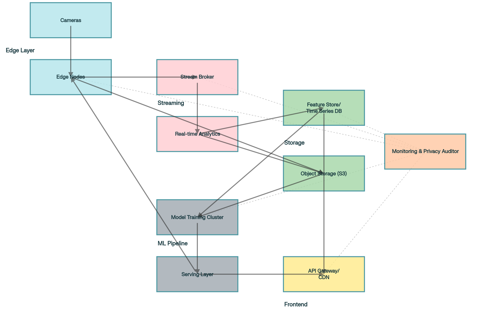

**Дисциплина:** Проектирование систем машинного обучения  
**Задание 3:** Умный ритейл - Тепловая карта движения покупателей в супермаркете    
**Группа:** М8О-214СВ-24    
**Студент:** Прудникова Анастасия Алексеевна    
11 декабря 2025

# Часть 1: Формулировка ML‑задачи

## 1.1 Бизнес‑цели и ключевые метрики

**Бизнес‑цели:**
- Повысить эффективность размещения товаров и планограммы магазина.  
- Уменьшить потери от неоптимальной выкладки (корректировка зон горячего/холодного трафика).
- Обеспечить приватность клиентов при сборе аналитики.

**Ключевые бизнес‑метрики (KPI):**
1. Conversion lift в целевых зонах (%) - процентное увеличение продаж в зонах, оптимизированных по тепловой карте. Цель: +3–8% через 3 месяца после внедрения.  
2. Снижение времени простоя персонала (мин/день) - оптимизация расстановки персонала по трафику; метрика измеряется через сравнение планируемых и фактических затраченных часов.  
3. Соблюдение конфиденциальности (%) - доля видео/изображений, где лица размыты/анонимизированы. Цель: 100%.

## 1.2 Постановка ML‑задачи

**Формулировка:** задача состоит из двух взаимосвязанных подзадач:
1. Обнаружение людей и локализация (object detection) - выдача масок людей на каждом кадре. (задача детекции/сегментации).  
2. Трекинг и агрегация траекторий (multi‑object tracking + aggregation) - присвоение ID траекториям, агрегация позиций в пространственную сетку (heatmap). (детекция + ассоциация/ранжирование => последовательные события).

**Типы задач:**
- Детекция - классификация + локализация, object detection.  
- Трекинг - последовательное сопоставление (tracking/association/ranking).  
- Пост‑обработка для тепловой карты - агрегация по ячейкам сетки.

**Целевая переменная:**
- Для детекции - наличие человека и его координаты (bounding box/mask).  
- Для трекинга - ID траектории (association keys).  
- Для тепловой карты - количество уникальных «присутствий» или средняя длительность пребывания в каждой ячейке за заданный интервал.

## 1.3 Данные для обучения и валидации

**Необходимые данные:**
- Видео с камер супермаркета (разрешение/фреймрейт, разные углы обзора, освещение).  
- Аннотированные кадры: bounding boxes людей, маски сегментации.  
- Аннотации для трекинга: идентификаторы объектов в последовательностях кадров (для обучения ассоциации/ре‑идентификации).  
- Метаданные камер: расположение камеры в плане магазина, параметры проекции (H/FOV).  
- POS‑данные для сопоставления тепловых зон с продажами для бизнес‑метрик.  
- Анонимизированные примеры с размытыми лицами для проверки приватности.

**Количество данных:**
- ~50–200 тысяч аннотированных кадров для надежной детекции в пределах супермаркета
- ~200–1000 коротких видео‑последовательностей (30–300 кадров) с ID для обучения трекинга

## 1.4 Выбор моделей - минимум две опции

### Модель A: YOLOv8 (детекция) + DeepSORT (трекинг)
**Преимущества:**
- Высокая скорость инференса на GPU/Edge; подходит для реального времени.  
- Широкая экосистема и легкая интеграция.  
- DeepSORT даёт простую и быструю ассоциацию на основе appearance+motion.

**Недостатки:**
- DeepSORT может деградировать при плотных сценах/длинных occlusions без дообученной re‑id модели.  
- YOLO иногда уступает по точности современным трансформерным моделям на рынках с сложным фоном.

### Модель B: EfficientDet / CenterNet + FairMOT (или byteTrack)
**Преимущества:**
- FairMOT совмещает детекцию и трекинг в единой сети - лучшее качество ассоциации при плотном трафике.  
- EfficientDet даёт неплохой компромисс точности и скорости на CPU/GPU, если требуется экономичный inference.

**Недостатки:**
- Более высокая сложность внедрения и тонкая настройка.  
- Меньшее сообщество и референтная реализация по сравнению с YOLO.  

**Выбор для дальнейшего проектирования:** **YOLOv8 + DeepSORT**.

**Обоснование выбора:** YOLOv8 + DeepSORT даёт наилучший стартовый компромисс между скоростью, простотой и точностью для бизнес‑целей. Можно добавить дообучение re‑id и использовать ByteTrack/FairMOT как опциональную компоненту при росте требований к качеству трекинга.

# Часть 2: Проектирование архитектуры

## 2.1 Высокоуровневая архитектура системы

**Ключевые компоненты:**
- Камеры (Edge) - локальная обработка: детекция лиц => размытие (анонимизация) => сжатие.  
- Edge Inference Nodes - быстрый детектор + локальный трекинг (опция) для уменьшения трафика.  
- Stream Broker (Kafka/Kinesis) - передача анонимизированных событий (bounding boxes, траектории) и метрик.  
- Real‑time Analytics (Flink/Beam or ksqlDB) - агрегация по сетке (heatmap), оконная агрегация.  
- Feature Store/Time Series DB (InfluxDB, Timescale) - хранение агрегированных тепловых карт.  
- Object Storage (S3) - хранение анонимизированных кадров/мини‑видео для отладки и ретроспективного обучения (ср. ретеншен 7–30 дней).  
- Model Training Cluster (K8s + GPU nodes) - обучение/дообучение моделей.  
- Serving Layer (K8s Horizontal Autoscaling + GPU/CPU instances) - REST/gRPC endpoint для модели (batch & streaming).  
- API Gateway/CDN - внешние запросы дашбордов/мобильных приложений.  
- Monitoring & Privacy Auditor - проверка размывания лиц и задержек.

## 2.2 Архитектура Data Pipeline

**Поток данных:**
1. Камеры => Edge preprocessing (denoise, resize, face blur).  
2. Анонимизированный поток (кадры или ключевые фичи) публикуется в Stream Broker.  
3. Stream Consumers (Edge/Cloud) выполняют детекцию/трекинг и отправляют события: `{timestamp, store_id, cam_id, x,y,track_id,confidence}`.  
4. Real‑time Aggregator делает spatial binning (grid) => incremental heatmap updates.  
5. Хранение агрегатов в TSDB + snapshot в object storage.

**Privacy step:** размытие лиц на Edge или первичном cloud‑узле (ниже 1‑ms дополнительного latency per frame на edge)

## 2.3 Архитектура Training Pipeline

**Основные шаги:**
- Data Ingestion: выбор аннотированных кадров/последовательностей из object storage.  
- Data Augmentation: имитация разных освещений, поворотов камер, occlusion, synthetic blur.  
- Training: distributed training на GPU (PyTorch, DDP).  
- Validation & Metrics: mAP для детекции, MOTA/MOTP для трекинга, latency profiling.  
- Model Registry (MLflow/Triton Model Repository): версии моделей, артефакты, метаданные.  
- CI/CD: автоматическое тестирование качества и canary deploy для serving.

## 2.4 Архитектура Inference Pipeline (Serving)

**Стратегии сервинга:**
- Edge first: простое детектирование + blur выполняется максимально на edge (Raspberry/Jetson/Intel NUC), лишь события стримятся.  
- Hybrid cloud: тяжёлая модель (повышенной точности) может работать в облаке для ретроаналитики/дообучения.  
- Autoscaling: горизонтальное масштабирование model‑serving под пиковую нагрузку, очередь запросов + priority for real‑time streams.

**SLA для latency:** поддерживать p95 < 259 ms для *полного цикла* обработки одного user/API запроса (включая сетевые задержки). Для локальной inference latency целевого кадра должно быть < 100 ms.

# Часть 3: Расчёты и нефункциональные требования

## 3.1 Входные данные и допущения

- DAU (пользователей в день): 1377775.  
- Peak RPS: 5557 запросов в секунду.  
- Target latency: ≤ 259 ms (полный ответ).  
- Среднее число анализируемых событий на пользователя: 10 (подходящие «попадания»/позиции в сетке за посещение).  
- Размер одного event‑сообщения (json): 200 байт.  
- Grid heatmap: 100 × 100 = 10000 ячеек на магазин.  
- Агрегация: каждую минуту обновляется snapshot heatmap.  
- Число магазинов в сети (assumption): 500 (если у вас другое число - масштабируйте линейно).

## 3.2 Расчёт требований к пропускной способности

**1) Общее число событий в день:**
- events_per_day = DAU × events_per_customer = 1377775 × 10 = 13777750 событий в день.

**2) Суточный трафик (байты):**
- bytes_per_day = events_per_day × 200 = 2755550000 байт ≈ 2.76 ГБ/день.

**3) Пиковая одновременная нагрузка (конкурентность) при SLA:**
- concurrency = RPS × latency(с)  
  latency = 259 ms = 0.259 s  
  concurrency = 5557 × 0.259 = 1439.263 одновременных запросов.

**4) Число application instances (примерная оценка):**
- Предположим один instance приложения выдерживает 200 одновременных соединений (workers/event loop).  
- required_instances = ceil(1440 / 200) = 8 инстансов (горизонтальное автоскейлинг + запас ‑ 1.5× для отказоустойчивости => deploy 12 инстансов).

**5) Throughput model serving**
- Если inference выполняется на GPU: допустим один GPU‑node может обрабатывать 250 детекций в секунду (зависит от модели и батча).  
- Для пиковой нагрузки 5557 inf/s потребуется ≈ 5557 / 250 = 23 GPU.  
- Рекомендуемая конфигурация: старт 8 GPU для обычных часов + autoscale до 24 GPU на пик (spot/ondemand mix).

## 3.3 Расчёт требований к хранилищу

**A. Хранение агрегированных тепловых карт (TSDB):**
- Для одной сетки 100×100 = 10000 ячеек.  
- Если сохраняем значение float64 (8 байт) => 10000 × 8 = 80000 байт ≈ 78.13 KB за snapshot.  
- Частота snapshot: 1 минута => 1440 снапшотов в день => per_store/день = 78.13 KB × 1440 ≈ 112500 KB ≈ 110 MB/день/магазин.
- Для 500 магазинов => 110 MB × 500 = 55000 MB ≈ 53.7 ГБ/день.
- Ретеншен агрегатов (365 дней): 53.7 ГБ × 365 ≈ 19.6 TB.

**B. Сохранение event‑логов (json):**
- событий в день (всего) = 13777750 => 2.76 ГБ/день.  
- Для 30‑дневного ретеншена ≈ 82.6 ГБ.

**C. Object storage (анонимизированные кадры / мини‑видео):**
- Допущение: сохранение 1 кадра/5‑сек для каждой камеры в сети для отладки.  
- Пусть среднее число камер на магазин = 50 => кадры/sec per store = 50 / 5 = 10 кадров/sec => 864000 кадров/день/store.  
- Размер уменьшенного анонимизированного кадра (jpeg low‑res) ≈ 20 KB => per_store/день = 864000 × 20 KB = 17280000 KB ≈ 16.5 ГБ/день/магазин - это очень много; все кадры постоянно не хранятся.

**Решение проектной архитектуры хранения видео:**
- Хранить только агрегаты + events.  
- Хранить анонимизированные кадры/мини‑видео только при инциденте или последующем анализе. 
- Если нужно кратковременное хранение - хранить 1% кадров или сохранить низкокачественные версии (2 KB), что сильно уменьшает объём.

## 3.4 Масштабируемость и надёжность

**Архитектурные решения для масштабируемости:**
- Stream Broker (Kafka) с несколькими partition per store/camera для горизонтального масштабирования.  
- Stateless microservices (inference API, API Gateway) с горизонтальным autoscaling (Kubernetes + HPA/VPA).  
- Stateful components (TSDB, DB) - кластерный режим (TimescaleDB/InfluxDB × Replication).  
- Model serving: Triton/TF‑Serving с GPU pool + autoscale; fallback на CPU‑light model версия при перегрузке.

**Надёжность и отказоустойчивость:**
- Deploy в мультизональной инфраструктуре (AZs).  
- Репликация критичных сервисов (Kafka zookeeper, controller, DB replicas).  
- Circuit breakers и retry policy между микросервисами.  
- Canary deploy + automatic rollback при деградации качества (mAP/p95 latency thresholds).

## 3.5 Приватность и безопасность

- Face‑blurring выполняется на edge либо сразу при приёме видеопотока в cloud - гарантируем 100% размытия лиц перед сохранением.  
- Данные трекинга хранятся без пикселей/кропов лиц (координаты и хеши ID).  
- Аудит и верификация: периодические проверки (privacy auditor) - выборочная проверка кадра/логов.  
- Шифрование: TLS для потоков, серверное шифрование S3 (SSE).  
- Ретеншен: минимальный срок хранения персональных данных (по нормативам 7–30 дней) и возможность удаления по запросу.

## 3.6 Диаграмма

# Список источников

1. Redmon J., Farhadi A., "YOLO: Real‑Time Object Detection" 
2. Wojke, Bewley & Paulus, "Simple Online and Realtime Tracking with a Deep Association Metric"
3. Ramon, et al., "FairMOT: On the Fairness of Detection and Re‑Identification in Multi‑Object Tracking"
4. Документация Kafka
5. Документация Apache Flink
6. Документация TimescaleDB
7. Документация Prometheus

